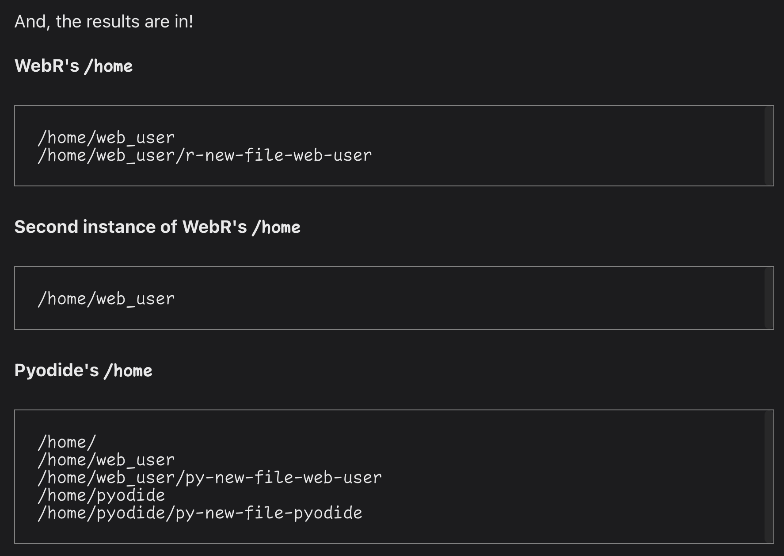

# 🧪 WebR + Pyodide and Emscripten's Filesystem

## Sharing Data Between R and Python Environments

Experiment parameters:

- Webr
- Pyodide
- Emscripten's Filesystem
- R template tag function
- Lit (web components)
- Vite (for building)

Info is [here](https://rud.is/w/webr-lit-plot/)

